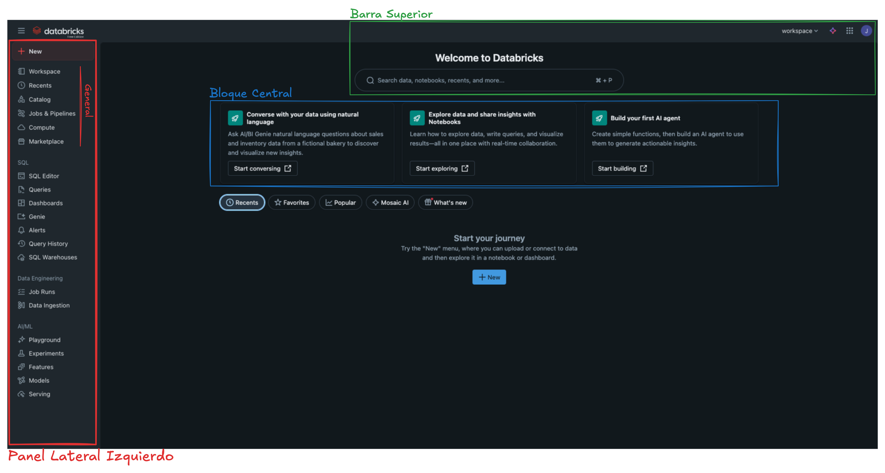

# Guía del Entorno Databricks: Free Edition

Esta guía describe los elementos principales de la interfaz de **Databricks Free Edition**, su propósito y cómo aprovecharlos durante el curso.

---

## Vista general

Al ingresar a Databricks, encontrarás tres áreas principales:

1. **Panel lateral izquierdo:** navegación general y herramientas principales.
2. **Panel central:** accesos rápidos para iniciar proyectos.
3. **Barra superior:** búsqueda y configuración de usuario.

---

## Panel lateral izquierdo

| Sección              | Elemento             | Descripción                                     | Uso principal                         |
| -------------------- | -------------------- | ----------------------------------------------- | ------------------------------------- |
| **General**          | **+ New**            | Crea notebooks, consultas SQL, dashboards, etc. | Iniciar un nuevo recurso.             |
|                      | **Workspace**        | Carpeta principal del usuario.                  | Organizar notebooks y proyectos.      |
|                      | **Recents**          | Elementos abiertos recientemente.               | Acceso rápido a trabajo previo.       |
|                      | **Catalog**          | Muestra tablas y bases de datos registradas.    | Consultar o crear tablas.             |
|                      | **Jobs & Pipelines** | Automatiza tareas o flujos ETL/ELT.             | Programar pipelines (limitado).       |
|                      | **Compute**          | Gestiona clusters.                              | Crear o detener el cluster.           |
|                      | **Marketplace**      | Acceso a datasets públicos.                     | Solo visualización en Free Edition.   |
| **SQL**              | **SQL Editor**       | Interfaz para ejecutar código SQL.              | Consultar datos directamente.         |
|                      | **Queries**          | Historial y gestión de consultas guardadas.     | Reutilizar código SQL.                |
|                      | **Dashboards**       | Paneles visuales basados en SQL.                | Crear visualizaciones interactivas.   |
|                      | **Genie**            | Asistente de lenguaje natural para consultas.   | Preguntas tipo “¿ventas por región?”. |
|                      | **Alerts**           | Notificaciones basadas en resultados SQL.       | No disponible en Free Edition.        |
|                      | **Query History**    | Historial de consultas ejecutadas.              | Auditoría o recuperación.             |
|                      | **SQL Warehouses**   | Endpoints SQL dedicados.                        | Solo en planes Enterprise.            |
| **Data Engineering** | **Job Runs**         | Registro de ejecuciones de Jobs.                | Supervisión de tareas automáticas.    |
|                      | **Data Ingestion**   | Asistente para importar datos.                  | Ingesta inicial de datasets.          |
| **AI/ML**            | **Playground**       | Entorno experimental de IA.                     | Probar Mosaic AI (opcional).          |
|                      | **Experiments**      | Registro de experimentos MLflow.                | Seguimiento de modelos.               |
|                      | **Features**         | Feature Store para ML.                          | No disponible en Free Edition.        |
|                      | **Models**           | Catálogo de modelos entrenados.                 | Registro y versionado.                |
|                      | **Serving**          | Despliegue de modelos.                          | Limitado en Free Edition.             |

---

## Panel central

### Bloques principales

| Bloque                                             | Descripción                                        | Uso                                 |
| -------------------------------------------------- | -------------------------------------------------- | ----------------------------------- |
| **Converse with your data using natural language** | Usa Genie para explorar datos en lenguaje natural. | Ejemplo de AI integrada.            |
| **Explore data and share insights with Notebooks** | Crea notebooks para análisis colaborativo.         | Punto de inicio del curso.          |
| **Build your first AI agent**                      | Tutorial de Mosaic AI.                             | Opcional para exploración avanzada. |

**Botón principal:**  
`+ New` → Crea un nuevo recurso (Notebook, SQL Query o Dashboard).

---

## Barra superior

| Elemento                   | Descripción                                 | Uso                            |
| -------------------------- | ------------------------------------------- | ------------------------------ |
| **Search bar**             | Busca notebooks, tablas y queries.          | Localizar recursos fácilmente. |
| **workspace ▼**            | Cambiar entre entornos (si existen varios). | No aplica en Free Edition.     |
| **Perfil / Configuración** | Preferencias, tokens y cierre de sesión.    | Gestión personal.              |

---

© 2025 - Curso: Introducción Práctica a Databricks: Ingeniería, Ciencia de Datos y ML-Flow
